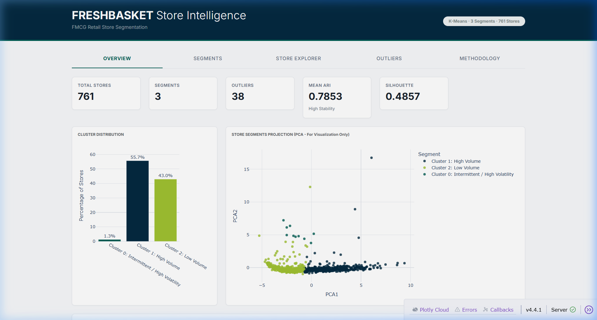
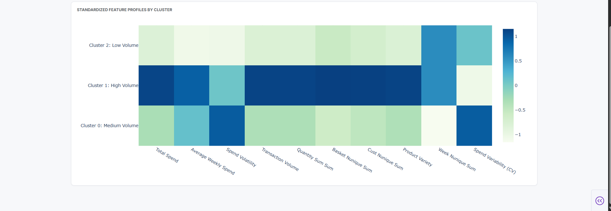
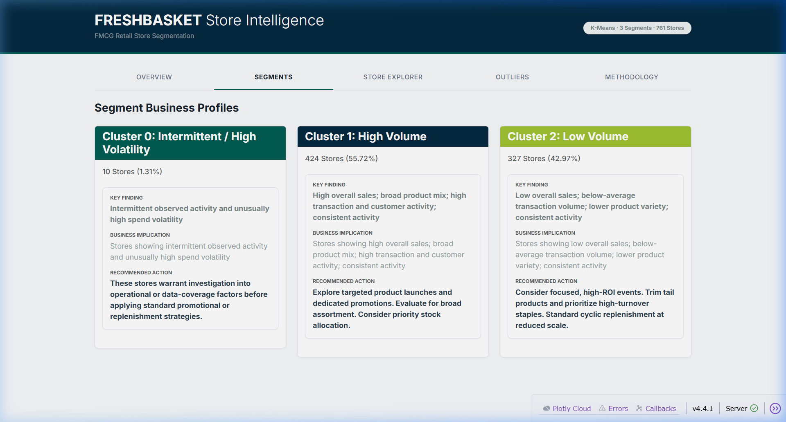
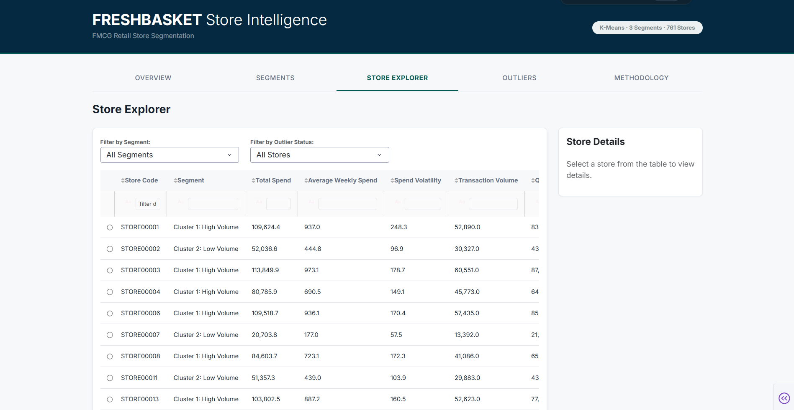
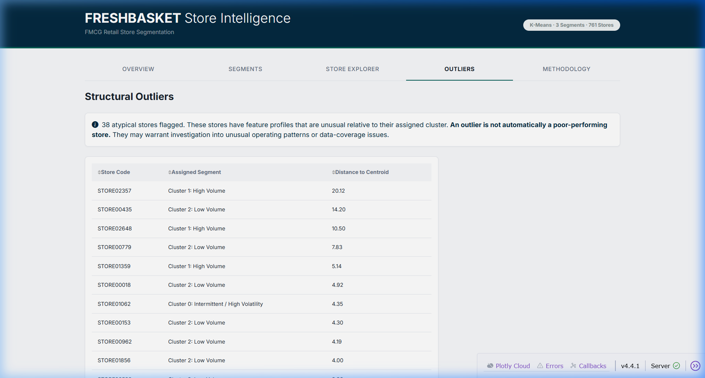
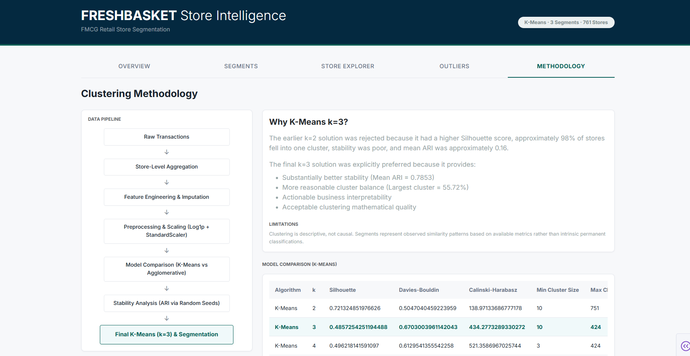

# FMCG Retail Store Segmentation

## FreshBasket Consumer Products

FreshBasket operates a large network of retail stores. Historically, stores were classified purely by geographic region or static channel formats. However, this static approach fails to capture the true behavioral nuances of store performance, leading to inefficient "one-size-fits-all" commercial strategies. 

This project aims to address this problem by employing unsupervised machine learning (clustering) to segment stores based on actual transactional behavior. By understanding how stores behave in terms of sales volume, volatility, and customer patterns, FreshBasket can design differentiated, highly targeted strategies for assortment, promotion, and inventory management.

## Dashboard Preview

### Overview



### Store Segment Profiles


### Store Explorer


### Outlier Analysis


### Clustering Methodology


## Executive Summary
This project processed over 31 million raw transaction records, aggregating them into robust behavioral profiles for **761 retail stores**. Using **K-Means clustering**, the stores were grouped into **3 distinct segments**. The final model prioritizes business interpretability and stability, achieving a **Mean ARI of 0.7853** across random seeds, a **Silhouette score of 0.4857**, and identifying **38 structural outliers**. 

*Note: Clustering is a descriptive analytical technique. It identifies observed behavioral similarity patterns, rather than intrinsic or permanent causal classes.*

## Business Objective
The core objective is to identify meaningful groups of stores based on behavioral characteristics so FreshBasket can actively differentiate its commercial operations:
- **Assortment:** Tailoring product breadth and depth to the store's typical demand.
- **Promotion:** Designing high-ROI events suited to the store's sales volatility.
- **Distribution & Inventory:** Prioritizing stock allocation and adapting replenishment cycles.
- **Sales-force Strategy:** Allocating regional manager attention effectively.

This segmentation elevates operations from mathematical clustering to an actionable business strategy framework.

## Data & Pipeline
Raw transaction rows were **not** directly clustered. Clustering billions of rows introduces computational bloat and noise. Instead, the pipeline was structured as follows:

1. Raw transaction data
2. Data-quality checks & cleansing
3. Store-level aggregation
4. Feature engineering
5. Preprocessing & scaling (Log1p + StandardScaler)
6. Clustering candidate evaluation
7. Validation & stability analysis
8. Cluster profiling
9. Business recommendations mapping
10. Interactive Plotly Dash dashboard

## Feature Engineering
Features were engineered at the store level to capture multidimensional behavioral patterns:
- **Sales Scale:** Total Spend, Average Weekly Spend, Total Quantity
- **Volatility:** Spend Volatility (Std), Spend Variability (CV)
- **Transaction Activity:** Transaction Volume
- **Product/Category Mix:** Product Variety (Unique Products)
- **Customer/Basket Behavior:** Unique Customers, Average Basket Size
- **Seasonality/Consistency:** Active Weeks

*(Note: Store identifiers and highly correlated redundant features were systematically excluded from the clustering feature space.)*

## Modeling Methodology
The modeling phase evaluated K-Means and Agglomerative (Ward linkage) algorithms across candidate values from k=2 through k=10. The selection process utilized standard mathematical metrics (Silhouette, Davies-Bouldin, Calinski-Harabasz) while uniquely incorporating **Adjusted Rand Index (ARI)** to measure stability across different initialization seeds. 

**Why k=3 was selected:**
While a k=2 solution yielded a technically higher absolute Silhouette score, it produced an extremely imbalanced segmentation (approximately 98% of stores in one cluster) and demonstrated exceptionally poor stability (Mean ARI ≈ 0.16). 

The k=3 solution was explicitly preferred because it provided:
- Substantially better mathematical stability
- A more useful and actionable cluster structure
- Reasonable cluster balance (Largest cluster = 55.72%)
- Clear business interpretability
- Acceptable clustering diagnostic quality

## Final Model Results

| Metric | Final Result |
|---|---:|
| Algorithm | K-Means |
| Clusters | 3 |
| Stores | 761 |
| Silhouette | 0.4857 |
| Davies-Bouldin | 0.6703 |
| Calinski-Harabasz | 434.2773 |
| Mean ARI | 0.7853 |
| Outliers | 38 |

*(Note: Calinski-Harabasz is a comparative diagnostic metric that measures between-cluster dispersion against within-cluster dispersion; higher is generally better when comparing models within the same feature space.)*

## Segment Profiles
The segmentation yielded the following profiles based on the store data:

- **Cluster 0 (Medium Volume):** 10 Stores (1.31%) — Stores exhibiting average, balanced characteristics.
- **Cluster 1 (High Volume):** 424 Stores (55.72%) — Stores demonstrating high overall sales and a broad category mix.
- **Cluster 2 (Low Volume):** 327 Stores (42.97%) — Stores with low overall sales and highly volatile demand patterns.

## Business Recommendations
The segments naturally align with specific operational strategies:

### Cluster 0: Medium Volume
- **Recommendation:** Marketing: Maintain standard promotions. Assortment: Keep balanced core product mix. Inventory: Standard cyclic replenishment. Opportunity: Steady incremental growth.

### Cluster 1: High Volume
- **Recommendation:** Marketing: Prioritize for premium product launches and dedicated promotions. Assortment: Maximize breadth. Inventory: High priority allocation. Opportunity: Key revenue driver.

### Cluster 2: Low Volume
- **Recommendation:** Marketing: Focused, high-ROI events only. Assortment: Trim tail products, focus on high-turnover staples. Inventory: Agile/lean replenishment to handle volatility. Opportunity: Cost optimization.

## Outlier Analysis
The pipeline identified **38 atypical stores** (the top 5% most distant from their respective cluster centroids using Euclidean distance). 
Outliers are not automatically poor-performing stores or errors. These stores warrant manual investigation, as they often represent unusually large flagship stores, structural data collection gaps, or highly distinct regional anomalies.

## Interactive Dashboard
A decision-support Dash application is provided, featuring five distinct areas:
- **Overview:** High-level KPIs, cluster distribution, PCA projection, and standardized feature heatmaps.
- **Segments:** Detailed profiles and automated business recommendations for each cluster.
- **Store Explorer:** Interactive, filterable data table for granular store-level inspection.
- **Outliers:** Dedicated analysis of structural anomalies.
- **Methodology:** Complete transparency into the data pipeline, algorithm comparison, and rationale behind the selected model.

## Business Value
Raw transactions → Behavioral understanding → Store segmentation → Differentiated commercial strategies.

By moving away from a one-size-fits-all approach, FreshBasket can leverage this intelligence for targeted assortment, optimized promotions, efficient inventory prioritization, and focused sales coverage, ultimately optimizing resource allocation across the network.

## Innovation / Additional Value
This project extends beyond standard academic clustering by implementing:
- Stability analysis using Adjusted Rand Index (ARI)
- PCA-based visual exploration
- Distance-to-centroid structural outlier detection
- Automated, business-oriented segment recommendations
- An interactive Business Intelligence dashboard

## Project Structure
```text
Assessment-2-Store-Segmentation/
├── app.py
├── requirements.txt
├── README.md
├── run_pipeline.py
├── assets/
│   ├── style.css
│   └── Screenshots/
│       ├── methodology.png
│       ├── outliers.png
│       ├── overview.png
│       ├── overview-heatmap.png
│       ├── segments.png
│       └── store-explorer.png
├── data/
│   ├── README.md
│   └── processed/
├── outputs/
│   ├── cluster_outliers.csv
│   ├── cluster_profiles.csv
│   ├── segment_recommendations.csv
│   └── store_segments.csv
├── reports/
│   ├── FINAL_REPORT.md
│   ├── cluster_stability.csv
│   ├── feature_groups.csv
│   ├── feature_inventory.csv
│   ├── feature_selection.csv
│   ├── final_candidate_comparison.csv
│   ├── final_segmentation_metrics.csv
│   ├── hierarchical_metrics.csv
│   └── kmeans_metrics.csv
└── src/
    └── a2_segmentation.py
```

## Setup & Running

This project uses Python. Ensure you have Python 3.9+ installed.

1. **Create and activate a virtual environment:**
```powershell
python -m venv .venv
.venv\Scripts\activate
```

2. **Install dependencies:**
```powershell
pip install -r requirements.txt
```

3. **Launch the interactive dashboard:**
```powershell
python app.py
```
*The dashboard will be available at http://127.0.0.1:8050*

## Reproducibility
- **`src/a2_segmentation.py`:** The core machine learning script. It loads the processed data, scales features, evaluates K-Means and Agglomerative clustering, generates reports, and produces the final data outputs.
- **`run_pipeline.py`:** A wrapper script designed to ensure the pipeline executes from the correct directory.
- **`app.py`:** The Dash application that consumes the static CSV outputs generated by the pipeline to serve the interactive UI.

## Limitations
- **Descriptive, not Causal:** Clustering maps observed behavioral patterns. It does not establish causal truth.
- **Feature Dependency:** Segment profiles are heavily dependent on the chosen historical features.
- **Atypical Stores:** Outlier stores must be investigated manually before taking strict business action.
- **Business Validation:** Proposed actions are hypotheses derived from behavior; they should be validated through controlled operational experiments.
- **Static Artifacts:** The current dashboard relies on static CSV outputs. Future production deployments would require dynamic data pipelines.

## Future Work
- **Time-Aware Segmentation:** Incorporating longitudinal changes in store behavior.
- **Soft Clustering:** Using probabilistic assignments (e.g., GMM) for stores that sit on the boundaries between segments.
- **Refreshed Production Pipeline:** Automating the data ingestion and preprocessing pipeline to keep segments current.
- **Controlled Testing:** Implementing A/B testing of the recommended segment-specific operational strategies.
- **Interactive KPI Monitoring:** Extending the dashboard to track real-time revenue and margin impacts of the new strategies.
